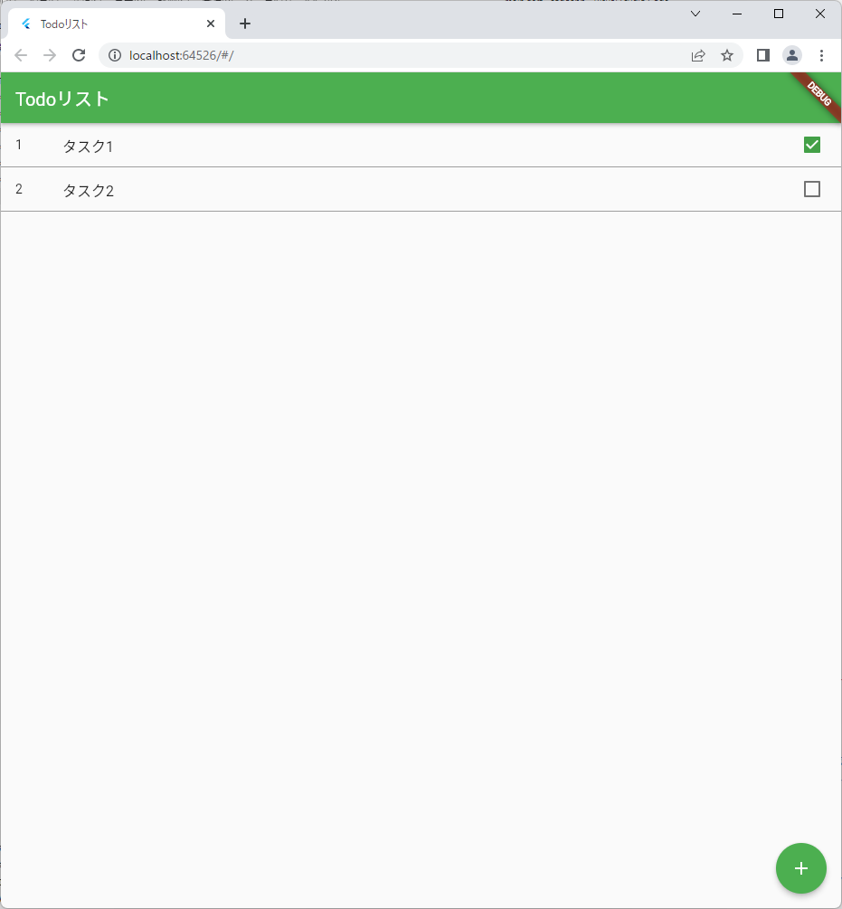
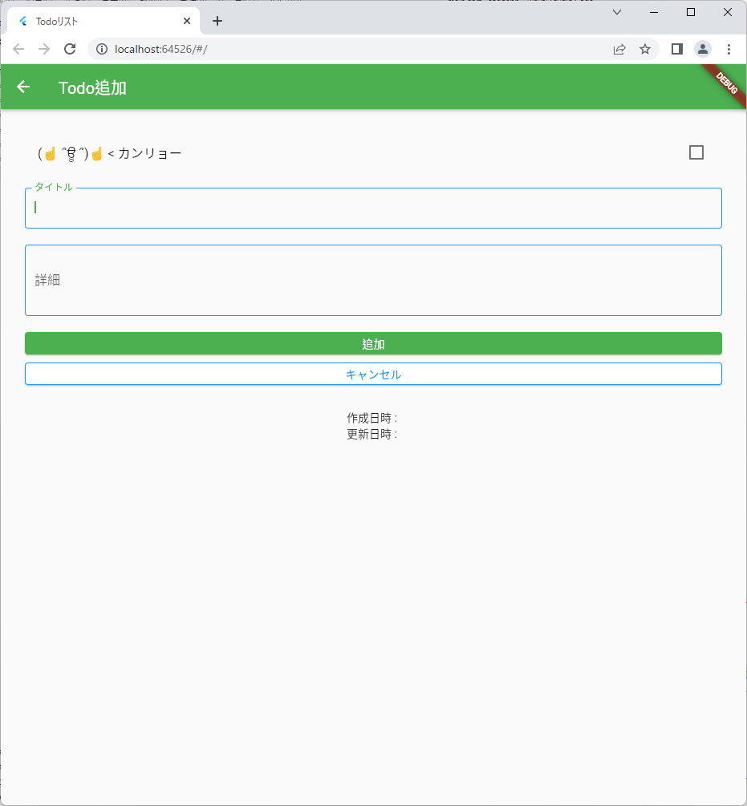

# sample todoapp

Flutter webで開発した簡易版Todoアプリ。

# 完成画面

## タスク表示画面



## タスク作成画面



# 使用したパッケージ

* `flutter_slidable`：スライドすることで「編集」「削除」ボタンを出力できる
* `intl`：日時をフォーマットするために使用する
* `shared_preferences`：Todoリストのデータをローカルストレージに保存

# 実装

## `lib/main.dart`

```dart
import 'package:flutter/material.dart';
import 'todo_list_page.dart';

void main() {
  runApp(const TodoListApp());
}

class TodoListApp extends StatelessWidget {
  const TodoListApp({Key? key}) : super(key: key);

  @override
  Widget build(BuildContext context) {
    return MaterialApp(
      title: 'Todoリスト',
      theme: ThemeData(
        primarySwatch: Colors.green,
      ),
      home: const TodoListPage(),
    );
  }
}
```

## `lib/todo_list_page.dart`

```dart
import 'package:flutter/material.dart';
import 'package:flutter_slidable/flutter_slidable.dart';
import 'todo_input_page.dart';
import 'todo_list_store.dart';
import 'todo.dart';

class TodoListPage extends StatefulWidget {
  const TodoListPage({Key? key}) : super(key: key);

  @override
  State<TodoListPage> createState() => _TodoListPageState();
}

class _TodoListPageState extends State<TodoListPage> {
  final TodoListStore _store = TodoListStore();

  void _pushTodoInputPage([Todo? todo]) async {
    await Navigator.of(context).push(
      MaterialPageRoute(
        builder: (context) {
          return TodoInputPage(todo: todo);
        },
      ),
    );

    setState(() {});
  }

  @override
  void initState() {
    super.initState();

    Future(
      () async {
        // ストアからTodoリストデータをロードし、画面を更新する
        setState(() => _store.load());
      },
    );
  }

  /// 画面を作成する
  @override
  Widget build(BuildContext context) {
    return Scaffold(
      appBar: AppBar(
        // アプリケーションバーに表示するタイトル
        title: const Text('Todoリスト'),
      ),
      body: ListView.builder(
        // Todoの件数をリストの件数とする
        itemCount: _store.count(),
        itemBuilder: (context, index) {
          // インデックスに対応するTodoを取得する
          var item = _store.findByIndex(index);
          return Slidable(
            // 右方向にリストアイテムをスライドした場合のアクション
            startActionPane: ActionPane(
              motion: const ScrollMotion(),
              extentRatio: 0.25,
              children: [
                SlidableAction(
                  onPressed: (context) {
                    // Todo編集画面に遷移する
                    _pushTodoInputPage(item);
                  },
                  backgroundColor: Colors.yellow,
                  icon: Icons.edit,
                  label: '編集',
                ),
              ],
            ),
            // 左方向にリストアイテムをスライドした場合のアクション
            endActionPane: ActionPane(
              motion: const ScrollMotion(),
              extentRatio: 0.25,
              children: [
                SlidableAction(
                  onPressed: (context) {
                    // Todoを削除し、画面を更新する
                    setState(() => {_store.delete(item)});
                  },
                  backgroundColor: Colors.red,
                  icon: Icons.edit,
                  label: '削除',
                ),
              ],
            ),
            child: Container(
              decoration: const BoxDecoration(
                border: Border(
                  bottom: BorderSide(color: Colors.grey),
                ),
              ),
              child: ListTile(
                // ID
                leading: Text(item.id.toString()),
                // タイトル
                title: Text(item.title),
                // 完了か
                trailing: Checkbox(
                  // チェックボックスの状態
                  value: item.done,
                  onChanged: (bool? value) {
                    // Todo(完了か)を更新し、画面を更新する
                    setState(() => _store.update(item, value!));
                  },
                ),
              ),
            ),
          );
        },
      ),

      // Todo追加画面に遷移するボタン
      floatingActionButton: FloatingActionButton(
        // Todo追加画面に遷移する
        onPressed: _pushTodoInputPage,
        child: const Icon(Icons.add),
      ),
    );
  }
}
```

## `lib/todo_input_page.dart`

```dart
import 'package:flutter/material.dart';
import 'todo_list_store.dart';
import 'todo.dart';

class TodoInputPage extends StatefulWidget {
  /// Todoのモデル
  final Todo? todo;

  /// コンストラクタ
  /// Todoを引数で受け取った場合は更新、受け取らない場合は追加画面となる
  const TodoInputPage({Key? key, this.todo}) : super(key: key);

  /// Todo入力画面の状態を生成する
  @override
  State<TodoInputPage> createState() => _TodoInputPageState();
}

class _TodoInputPageState extends State<TodoInputPage> {
  /// ストア
  final TodoListStore _store = TodoListStore();

  /// 新規追加か
  late bool _isCreateTodo;

  /// 画面項目：タイトル
  late String _title;

  /// 画面項目：詳細
  late String _detail;

  /// 画面項目：完了か
  late bool _done;

  /// 画面項目：作成日時
  late String _createDate;

  /// 画面項目：更新日時
  late String _updateDate;

  /// 初期処理を行う
  @override
  void initState() {
    super.initState();
    var todo = widget.todo;

    _title = todo?.title ?? "";
    _detail = todo?.detail ?? "";
    _done = todo?.done ?? false;
    _createDate = todo?.createDate ?? "";
    _updateDate = todo?.updateDate ?? "";
    _isCreateTodo = todo == null;
  }

  /// 画面を作成する
  @override
  Widget build(BuildContext context) {
    return Scaffold(
      appBar: AppBar(
        // アプリケーションバーに表示するタイトル
        title: Text(_isCreateTodo ? 'Todo追加' : 'Todo更新'),
      ),
      body: Container(
        // 全体のパディング
        padding: const EdgeInsets.all(30),
        child: Column(
          children: <Widget>[
            // 完了かのチェックボックス
            CheckboxListTile(
              title: const Text('(☝ ՞ਊ ՞)☝ < カンリョー'),
              value: _done,
              onChanged: (bool? value) {
                setState(() {
                  // Todo(完了か)のチェック状態を変更し、画面を更新する
                  _done = value ?? false;
                });
              },
            ),
            const SizedBox(height: 20),
            // タイトルのテキストフィールド
            TextField(
              autofocus: true,
              decoration: const InputDecoration(
                labelText: "タイトル",
                enabledBorder: OutlineInputBorder(
                  borderSide: BorderSide(
                    color: Colors.blue,
                  ),
                ),
                focusedBorder: OutlineInputBorder(
                  borderSide: BorderSide(
                    color: Colors.blue,
                  ),
                ),
              ),
              // TextEditingControllerを使用することで、いちいちsetStateしなくても画面を更新してくれる
              controller: TextEditingController(text: _title),
              onChanged: (String value) {
                _title = value;
              },
            ),
            const SizedBox(height: 20),
            // 詳細のテキストフィールド
            TextField(
              keyboardType: TextInputType.multiline,
              maxLines: null,
              minLines: 3,
              decoration: const InputDecoration(
                labelText: "詳細",
                enabledBorder: OutlineInputBorder(
                  borderSide: BorderSide(
                    color: Colors.blue,
                  ),
                ),
                focusedBorder: OutlineInputBorder(
                  borderSide: BorderSide(
                    color: Colors.blue,
                  ),
                ),
              ),
              // TextEditingControllerを使用することで、いちいちsetStateしなくても画面を更新してくれる
              controller: TextEditingController(text: _detail),
              onChanged: (String value) {
                _detail = value;
              },
            ),
            const SizedBox(height: 20),
            // 追加/更新ボタン
            SizedBox(
              width: double.infinity,
              child: ElevatedButton(
                onPressed: () {
                  if (_isCreateTodo) {
                    // Todoを追加する
                    _store.add(_done, _title, _detail);
                  } else {
                    // Todoを更新する
                    _store.update(widget.todo!, _done, _title, _detail);
                  }
                  // Todoリスト画面に戻る
                  Navigator.of(context).pop();
                },
                child: Text(
                  _isCreateTodo ? '追加' : '更新',
                  style: const TextStyle(color: Colors.white),
                ),
              ),
            ),
            const SizedBox(height: 10),
            // キャンセルボタン
            SizedBox(
              width: double.infinity,
              child: ElevatedButton(
                onPressed: () {
                  // Todoリスト画面に戻る
                  Navigator.of(context).pop();
                },
                style: ElevatedButton.styleFrom(
                  primary: Colors.white,
                  side: const BorderSide(
                    color: Colors.blue,
                  ),
                ),
                child: const Text(
                  "キャンセル",
                  style: TextStyle(color: Colors.blue),
                ),
              ),
            ),
            const SizedBox(height: 30),
            // 作成日時のテキストラベル
            Text("作成日時 : $_createDate"),
            // 更新日時のテキストラベル
            Text("更新日時 : $_updateDate"),
          ],
        ),
      ),
    );
  }
}
```

## `lib/todo_list_store.dart`

```dart
import 'package:shared_preferences/shared_preferences.dart';
import 'package:intl/intl.dart';
import 'dart:convert';
import 'todo.dart';

class TodoListStore {
  /// 保存時のキー
  final String _saveKey = "Todo";

  /// Todoリスト
  List<Todo> _list = [];

  /// ストアのインスタンス
  static final TodoListStore _instance = TodoListStore._internal();

  /// プライベートコンストラクタ
  TodoListStore._internal();

  /// ファクトリーコンストラクタ
  /// (インスタンスを生成しないコンストラクタのため、自分でインスタンスを生成する)
  factory TodoListStore() {
    return _instance;
  }

  /// Todoの件数を取得する
  int count() {
    return _list.length;
  }

  /// 指定したインデックスのTodoを取得する
  Todo findByIndex(int index) {
    return _list[index];
  }

  /// "yyyy/MM/dd HH:mm"形式で日時を取得する
  String getDateTime() {
    var format = DateFormat("yyyy/MM/dd HH:mm");
    var dateTime = format.format(DateTime.now());
    return dateTime;
  }

  /// Todoを追加する
  void add(bool done, String title, String detail) {
    var id = count() == 0 ? 1 : _list.last.id + 1;
    var dateTime = getDateTime();
    var todo = Todo(id, title, detail, done, dateTime, dateTime);
    _list.add(todo);
    save();
  }

  /// Todoを更新する
  void update(Todo todo, bool done, [String? title, String? detail]) {
    todo.done = done;
    if (title != null) {
      todo.title = title;
    }
    if (detail != null) {
      todo.detail = detail;
    }
    todo.updateDate = getDateTime();
    save();
  }

  /// Todoを削除する
  void delete(Todo todo) {
    _list.remove(todo);
    save();
  }

  /// Todoを保存する
  void save() async {
    var prefs = await SharedPreferences.getInstance();
    // SharedPreferencesはプリミティブ型とString型リストしか扱えないため、以下の変換を行っている
    // TodoList形式 → Map形式 → JSON形式 → StrigList形式
    var saveTargetList = _list.map((a) => json.encode(a.toJson())).toList();
    prefs.setStringList(_saveKey, saveTargetList);
  }

  /// Todoを読込する
  void load() async {
    var prefs = await SharedPreferences.getInstance();
    // SharedPreferencesはプリミティブ型とString型リストしか扱えないため、以下の変換を行っている
    // StrigList形式 → JSON形式 → Map形式 → TodoList形式
    var loadTargetList = prefs.getStringList(_saveKey) ?? [];
    _list = loadTargetList.map((a) => Todo.fromJson(json.decode(a))).toList();
  }
}

```

## `todo.dart`

```dart
// todoモデルの作成

// モデルの作成方法は設定してJSONに変換させる処理を書いて実行する、
// というのはDjangoと似ているような気がする
class Todo {
  /// ID
  late int id;

  /// タイトル
  late String title;

  /// 詳細
  late String detail;

  /// 完了か
  late bool done;

  /// 作成日時
  late String createDate;

  /// 更新日時
  late String updateDate;

  /// コンストラクタ
  Todo(
    this.id,
    this.title,
    this.detail,
    this.done,
    this.createDate,
    this.updateDate,
  );

  /// TodoモデルをMapに変換する(保存時に使用)
  Map toJson() {
    return {
      'id': id,
      'title': title,
      'detail': detail,
      'done': done,
      'createDate': createDate,
      'updateDate': updateDate
    };
  }

  /// MapをTodoモデルに変換する(読込時に使用)
  Todo.fromJson(Map json) {
    id = json['id'];
    title = json['title'];
    detail = json['detail'];
    done = json['done'];
    createDate = json['createDate'];
    updateDate = json['updateDate'];
  }
}

```

# 開発環境

* Windows 11
* Visual Studio Code 1.64
* Flutter 3

# 参考

[【Flutter】Todoリストアプリ作ってみた - Qiita](https://qiita.com/i-tanaka730/items/ee5a58ce9a9d7774feaa)